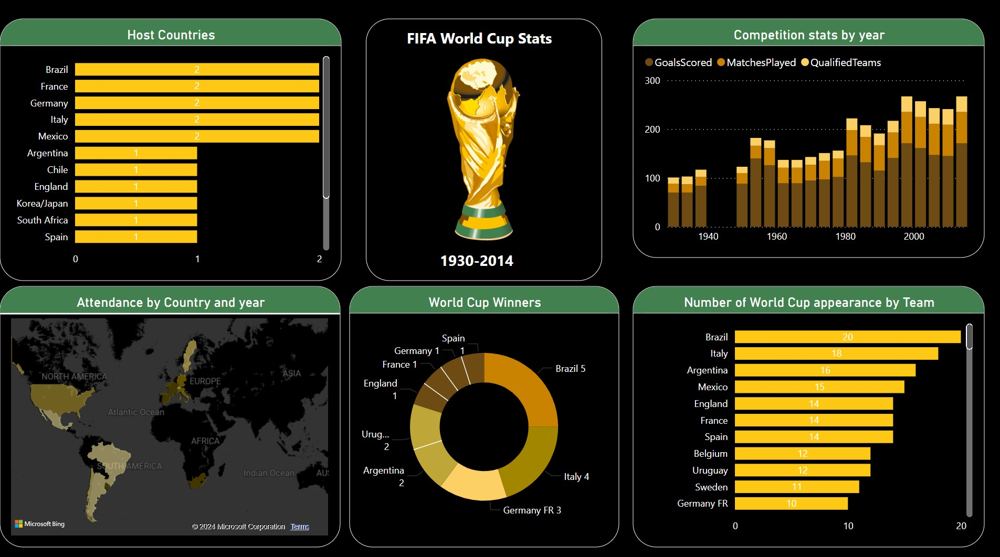

# Power BI World Cup Dashboard 📊🏆
This repository showcases a Power BI dashboard that visualizes various statistics from the FIFA World Cup. The dashboard includes multiple visualizations such as the host countries, FIFA World Cup stats, attendance by country and year, World Cup winners, number of World Cup appearances by team, and competition stats by year.

## Files

- `/data`: Contains the CSV files used for the dashboard.
- `/images`: Contains screenshots or PDF files of the dashboard.
- `/powerbi`: Contains the Power BI workbook file (.pbix).

## Visualizations

- **Host Countries:** Visualizes the frequency of countries hosting the World Cup.
- **FIFA World Cup Stats:** Displays key statistics like total goals scored, matches played, and qualified teams over time.
- **Attendance by Country and Year:** A map showcasing attendance patterns across different World Cups.
- **World Cup Winners:** A breakdown of winning teams and their frequency of wins.
- **Number of World Cup Appearances by Team:** Ranks teams based on their participation in the tournament.
- **Competition Stats by Year:** Shows the number of goals scored, matches played, and qualified teams in every edition.

## Data Sources

The data used in this dashboard was obtained from [Kaggle FIFA World Cup Dataset](https://www.kaggle.com/datasets/abecklas/fifa-world-cup). The CSV files included in this repository contain the raw data used to create the visualizations.

## Preview

